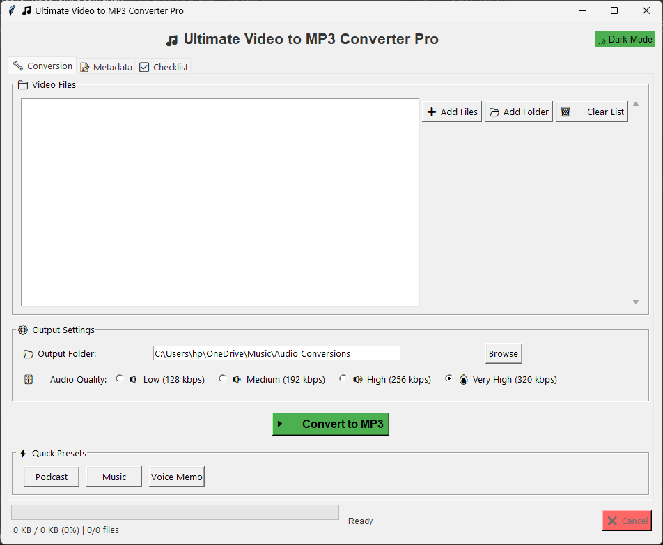

# VideoToMP3 Converter

 <!-- Add a screenshot if available -->

A user-friendly desktop application to convert video files to high-quality MP3 audio files with metadata support.

## Features

- 🎥 Convert multiple video formats to MP3
- 🎵 Preserve or edit audio metadata (title, artist, album)
- 🖼️ Add custom cover art
- ⚡ Multiple quality presets (128kbps to 320kbps)
- 📁 Batch conversion support
- 🎨 Light/Dark theme support

## Prerequisites

- Python 3.8+
- FFmpeg (will be installed automatically if missing)

## Installation

1. Clone the repository:
   ```bash
   git clone https://github.com/yourusername/VideoToMP3Converter.git
   cd VideoToMP3Converter
   
2. Install dependencies:
   ```bash
   pip install -r requirements.txt

## Running Locally
     python VideoToMP3Converter.py

## Building Standalone Executable
Using PyInstaller (Recommended for end users):

      pip install pyinstaller
      pyinstaller --onefile --windowed --icon=assets/music.ico VideoToMP3Converter.py

The executable will be in the dist/ folder.

## Using cx_Freeze (Alternative):

      pip install cx_Freeze
      python setup.py build
The executable will be in the build/ folder.

## Usage Guide
1. Add videos using:
     - "Add Files" for individual files
     - "Add Folder" for batch conversion

2. Set output preferences:
      - Choose output folder
      - Select audio quality

3. (Optional) Edit metadata in the Metadata tab

4. Click "Convert to MP3" to start conversion

## Supported Input Formats
   - MP4, AVI, MOV, MKV, FLV, WMV and more

## Troubleshooting
**FFmpeg not found error:**
   - On Windows, download FFmpeg from https://ffmpeg.org/
   - Add it to your system PATH
   - Or place ffmpeg.exe in the same folder as the application

**Conversion fails:**
   - Try with different video files
   - Ensure you have write permissions in the output folder

## Contributing
Contributions are welcome! Please open an issue or submit a pull request.

### Key Elements Included:

1. **Visual Appeal**: Space for screenshot and emojis
2. **Clear Installation Instructions**: Both for development and end users
3. **Multiple Build Options**: PyInstaller and cx_Freeze
4. **Usage Guide**: Simple step-by-step
5. **Troubleshooting**: Common issues and solutions
6. **Format Support**: Clear list of supported formats
7. **Metadata Focus**: Highlights the metadata editing feature

### Recommended Repository Structure:

      VideoToMP3Converter/
      ├── assets/                  # Static assets
      │   ├── icons/               # Application icons
      ├── core/                    # Core application logic
      │   ├── __init__.py
      │   ├── converter.py         # Video conversion logic
      │   ├── metadata.py          # Metadata handling
      │   └── utils.py             # Utility functions
      ├── ui/                      # User interface components
      │   ├── __init__.py
      │   ├── components/          # Reusable UI widgets
      │   ├── themes.py            # Theme management
      │   └── frames.py            # Main application window
      │   └── components.py        # Header 
      ├── VideoToMP3Converter.py   # Main application entry point
      ├── requirements.txt         # Python dependencies
      ├── setup.py                 # Build configuration
      ├── README.md                # Project documentation

